# 인스타 댓글 스카우트 · Insta Comment Scout

내가 로그인한 **내 인스타그램 계정의** 게시물/릴스 댓글을 엑셀(.xlsx)로 내보내는 크롬 확장입니다. 100% 로컬에서 동작하며 외부 서버로 아무것도 보내지 않습니다.

A Chrome extension that exports comments from **your own** Instagram posts/reels to Excel (.xlsx). Runs 100% locally — nothing is sent to any server.

---

## 미리보기 / Screenshots

옵션 선택 → 자동으로 끝까지 수집 → 엑셀(.xlsx) 저장

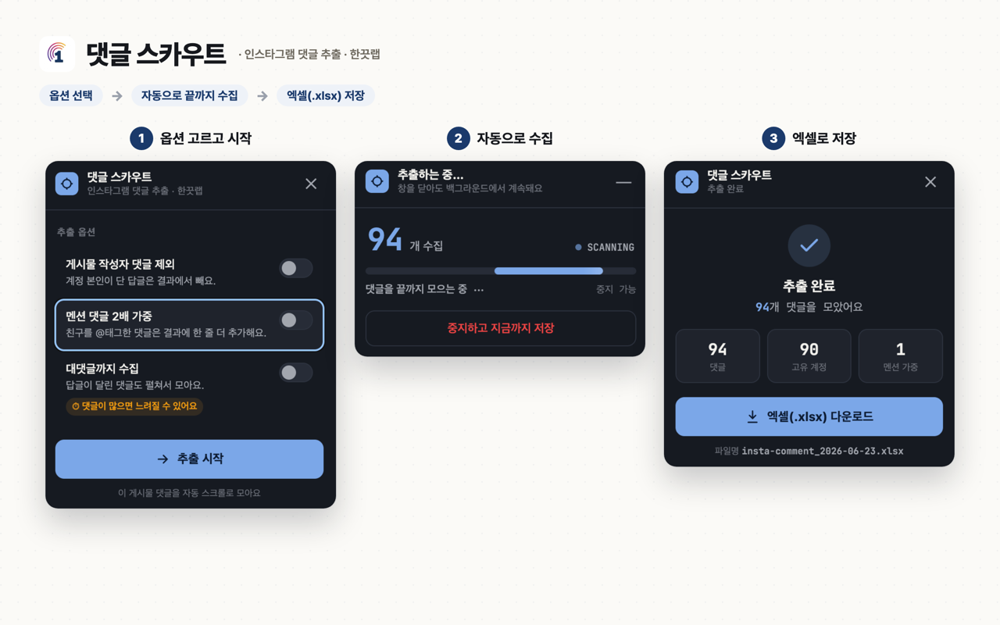

수집 결과는 바로 쓰는 엑셀로. *(아래는 예시 화면 — 실제 계정 정보는 가림 처리)*

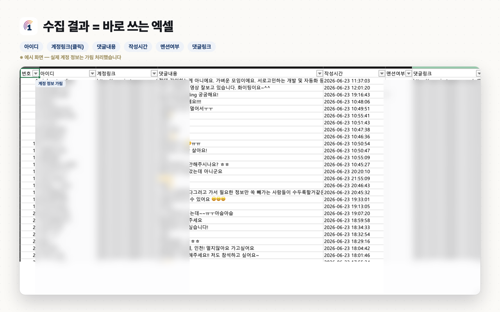

---

## ⚠️ 사용 범위 / Scope

> **본인 계정 전용 도구입니다.**
> 이 도구는 **사용자 본인이 로그인한 본인 계정의** 게시물 댓글을 내보내기 위한 교육·정보 목적의 도구입니다. 타인 계정 대량 수집 용도가 아닙니다.
> Instagram/Meta 약관 준수 책임은 사용자에게 있으며, 본 프로젝트는 Meta와 무관합니다. 수집 속도는 예의를 지키세요(과도한 자동화 금지).
>
> **For your own account only.** This tool is for exporting comments from posts on **the account you are logged into**, for educational/informational use. It is **not** for bulk-scraping other people's accounts.
> You are solely responsible for complying with Instagram's/Meta's Terms of Service. This project is **not affiliated with Meta**. Please be polite with collection speed (no aggressive automation).

---

## 기능 / Features

- 게시물·릴스 댓글 자동 스크롤 수집 (대댓글 펼침 옵션 포함)
- 작성자 핸들 · 댓글 본문 · 작성 시간 · 게시물 링크 추출
- 멘션 가중 집계 (이벤트/추첨 등에 활용)
- 엑셀(.xlsx) 다운로드 — [SheetJS](https://sheetjs.com) 사용
- 순수 로컬: 로그인/계정 연동/서버 통신 **없음**

## 설치 / Install

> **크롬 웹스토어에서 한 번에 설치하세요.** 아래 버튼을 눌러 `Chrome에 추가`만 하면 끝입니다.
> *Install directly from the Chrome Web Store — just click **Add to Chrome**.*

### 👉 [크롬 웹스토어에서 설치하기 / Install from Chrome Web Store](https://chromewebstore.google.com/detail/ieibmlgpbjcpdhkiamgccgcjmhigggla)

> 📘 **그림으로 보는 자세한 설치 가이드:** [www.one-scout.com/guide/insta-comment-install](https://www.one-scout.com/guide/insta-comment-install)
> *Step-by-step visual guide (Korean):* https://www.one-scout.com/guide/insta-comment-install

<b>개발자용: 소스에서 직접 설치 (개발자 모드) / For developers: load unpacked</b>

 

스토어 대신 이 저장소 소스로 직접 설치하려면 아래 단계를 따르세요.
*To install from this repository's source instead of the store, follow the steps below.*

**1. 이 페이지 위쪽 초록색 `Code` 버튼을 누릅니다.**

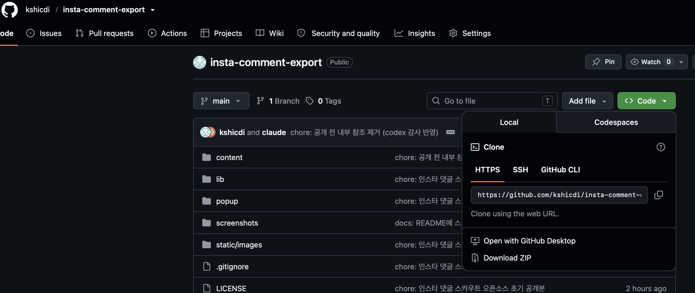

**2. 메뉴 맨 아래 `Download ZIP`을 눌러 압축 파일을 내려받습니다.**

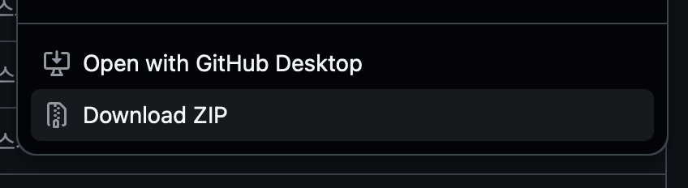

**3. 내려받은 ZIP 파일의 압축을 풉니다.** → `insta-comment-export-main` 폴더가 생깁니다. ⚠️ **이 "폴더"가 나중에 필요합니다(ZIP 파일이 아니라).**

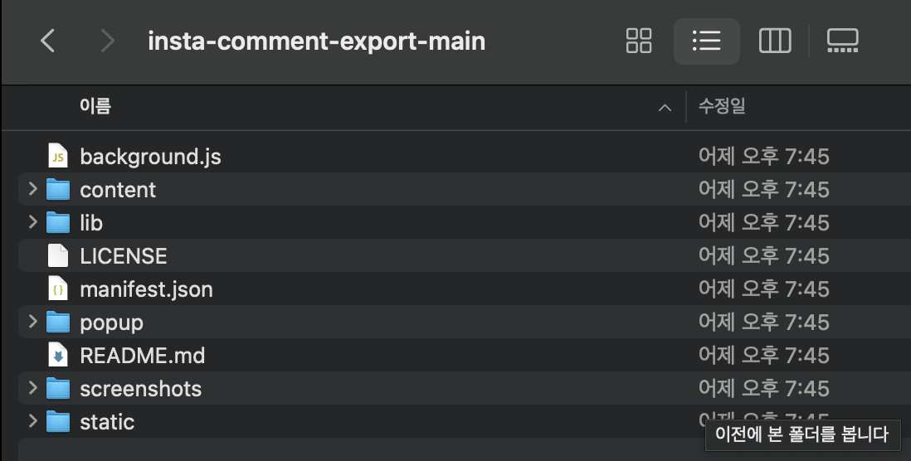

**4. 크롬 주소창에 `chrome://extensions` 를 입력해 확장 프로그램 페이지를 엽니다.**

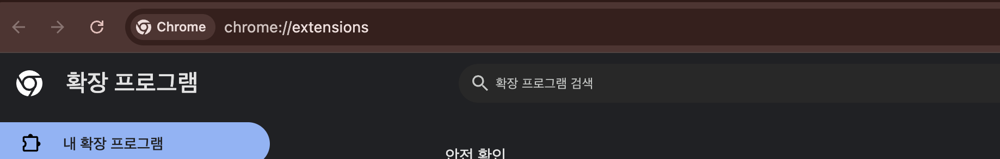

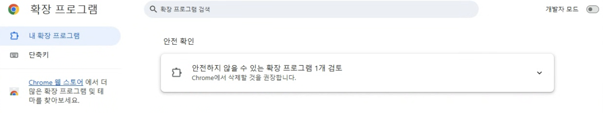

**5. 우측 상단 `개발자 모드`를 켭니다.**

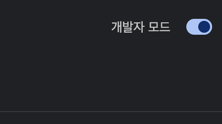

**6. 왼쪽 위 `압축해제된 확장 프로그램을 로드`를 누릅니다.**

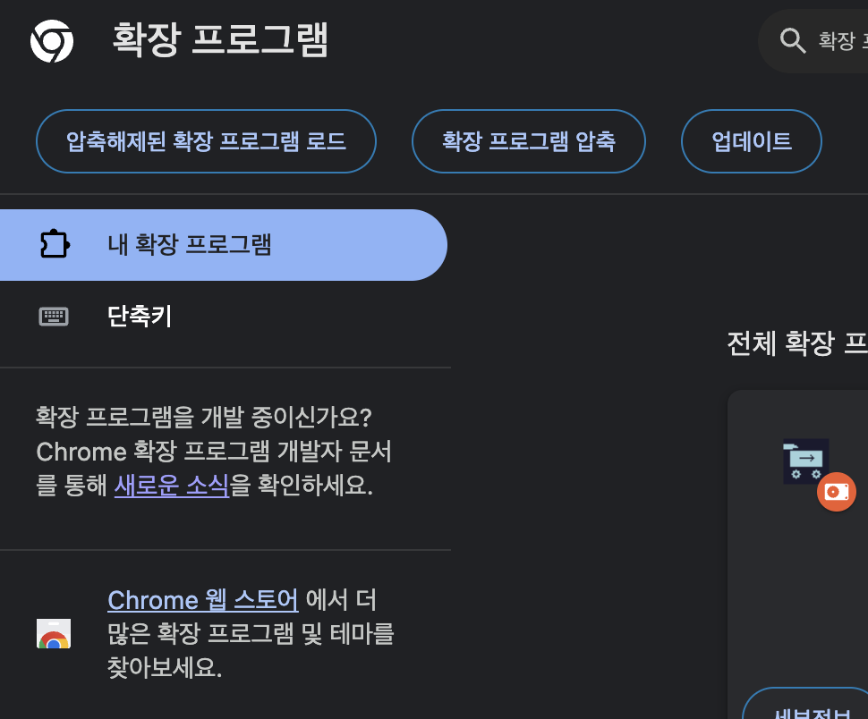

**7. 3번에서 압축을 푼 폴더를 선택합니다.** ⚠️ ZIP 파일 말고 **폴더**를 고르세요.

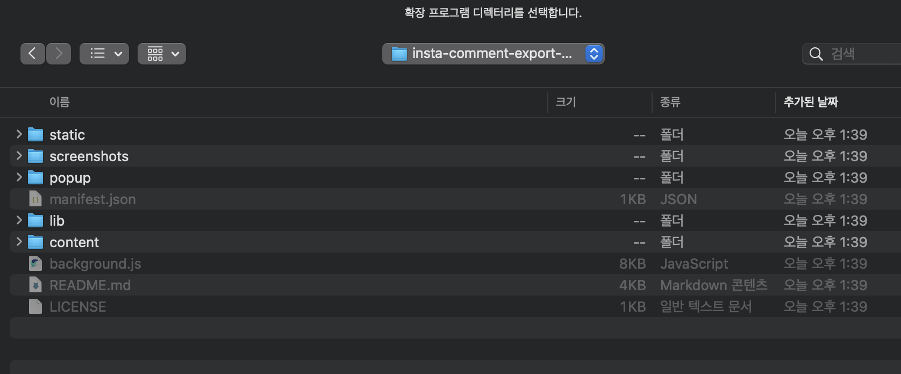

**8. 목록에 `인스타 댓글 스카우트`가 보이면 설치 완료입니다.**

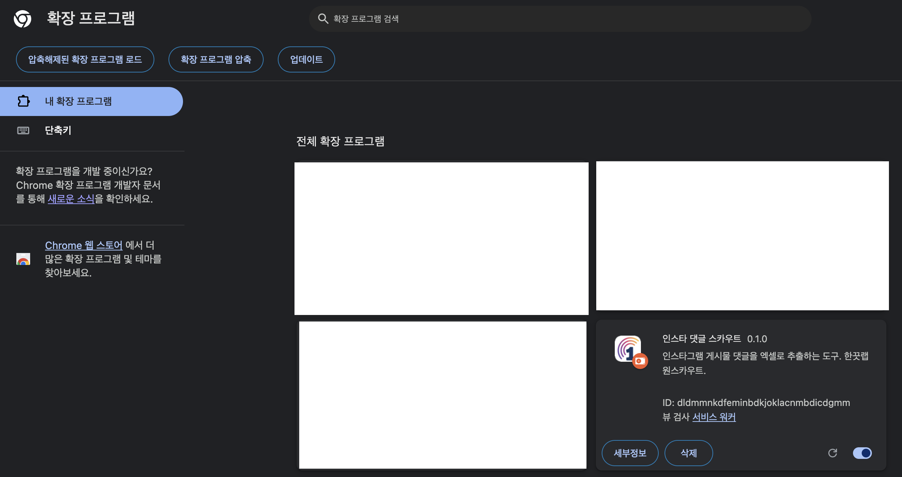

**9. (선택) 툴바의 퍼즐 아이콘에서 `인스타 댓글 스카우트`를 고정(📌)하면 쓰기 편합니다.**

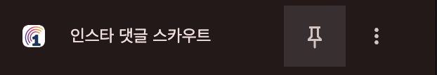

## 사용법 / Usage

**인스타그램 게시물/릴스를 연 뒤**, 확장 아이콘(또는 화면 **우측 하단 버튼**)을 눌러 시작합니다.

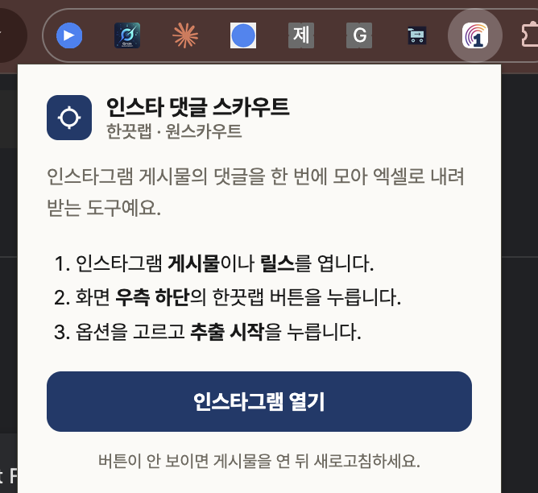

1. 내 인스타그램 게시물 또는 릴스 페이지를 엽니다.
2. 화면 **우측 하단의 버튼**을 누릅니다.
3. (선택) 대댓글 펼침·작성자 제외 등 옵션을 설정하고 수집을 시작합니다.
4. 수집이 끝나면 **엑셀 다운로드** 버튼으로 .xlsx 파일을 받습니다.

## 권한 / Permissions

- `storage` — 진행 상태를 로컬에 임시 저장 (외부 전송 없음)
- `https://www.instagram.com/*` — 인스타그램 페이지에서만 동작

API 키·토큰·외부 서버 호출이 전혀 없습니다.

---

## 댓글을 모았으면, 그다음은? / After you collect

수집한 댓글을 AI로 분석해 **소비자 니즈·자주 묻는 문의·반응 클러스터**를 자동으로 뽑아주는 기능은 **원스카우트(OneScout)** 에서 제공합니다.

This extension handles collection. AI analysis of the comments — surfacing customer needs, FAQs, and sentiment clusters — is available in **OneScout**.

👉 https://one-scout.com

---

## 라이선스 / License

MIT © 2026 Hankkeut Lab. 자세한 내용은 [LICENSE](./LICENSE) 참조.

This project is not affiliated with, endorsed by, or sponsored by Meta Platforms, Inc. "Instagram" is a trademark of Meta Platforms, Inc.
